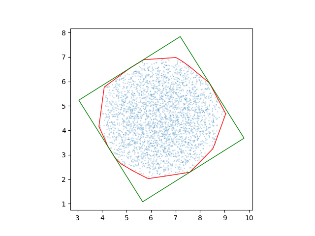
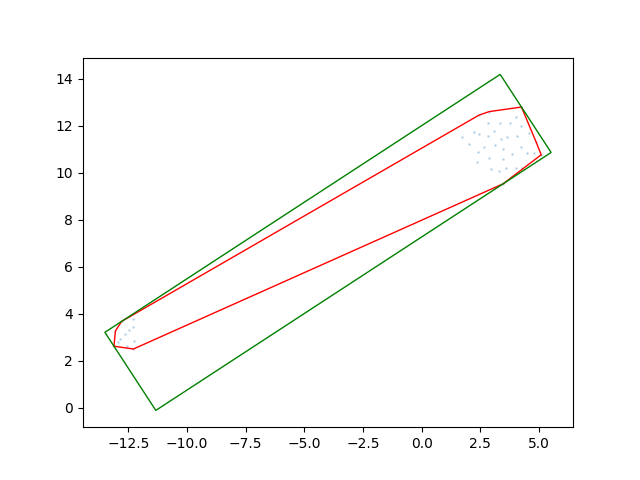

```{r setup, include=FALSE}
knitr::opts_chunk$set(echo = FALSE)
```


## Introduction

This project aims to develop a CNN in R capable of classifying ecological processes that govern microbial community assembly. The current stage is identifying between *antagonism* and *stochasticity*.

## Background

This project emerged from research on the microbiomes of Mangroves in Southeast Asia. These plants have been threatened by development, and recent efforts have focused on transplanting them into sanctuaries, protected lands, and new suitable environments. It has been found that out-planting success is improved when transplanted with mutualistic microbes. Even though it increases the success rate of the plant living and thriving in the new environment, processes that govern the assembly of microbial communities are little understood. We can identify certain relationships between microbes on larger scales and observe these processes at play. However, the challenge arises when we have to analyze thousands of microbes and identify how their various relationships work together to produce the outcome. Currently, there are no computational techniques for modeling these interactions. In recent years, various neural network structures have proven successful at closely approximating the outcome of non-linear problems. Thus, this project seeks to use convolutional neural networks (CNNs) to identify and classify the relationships in microbial community matrices.

CNNs are a type of neural network that takes in spatially related data, utilizes an encoder structure to develop a latent representation of that image, and then employs a couple of classifying layers to classify the input image into the pre-determined classes.

## Data

The data generated for this project was using an R package called CommunityAssemblR. In this project, it was used to generate matrices of microbial communities with antagonistic and stochastic processes at play. For each, it generates a resident community and then a donor difference matrix. The donor difference matrix illustrates the difference in the donor microbial community. This data had to be preprocessed as it was not spatially related.

To spatially arrange the data, a python package called DeepInsight was used. It employs dimensionality reduction techniques to produce images of the microbial community data. It goes through every row in an input matrix and produces an image representation of it. 




These Images were saved as NumPy arrays and loaded in R. The first step involving R in this project was the loading and pre-processing of the data. The packages used in R to develop this network are based on Python libraries so they are a little bit different to work with compared to your typical R package. 

```{r load_libraries, echo=TRUE, message=FALSE}
# Load necessary libraries
#reticulate::install_python()
library(tidyverse)
library(keras3)
library(tensorflow)
library(stringr)
library(reticulate)
library(caret)
np <- import("numpy")
#envir::import_from(dplyr, last)
```

The next couple of functions go through the two directories in the data_directory and process each file. On each file, they take the trial number, determine if it’s antagonistic or stochastic, get the resident input, donor output, sample number, and append it to a data frame. 

```{r Procces_data, echo=TRUE, message=FALSE}
process_array <- function(file1, file2){
  index_01 <- dim(file1)[1]
  index_02 <- dim(file2)[1]

  data <- list()
  if (index_01 == index_02){

    for (row in 1:index_01){

      resident_input <- file2[row,,,]
      donor_output <- file1[row,,,]
      output <- list(resident_input = resident_input, donor_output = donor_output, sample_num = row)
      data[[row]] <- output
    }

    return(data)

  } else {
    print("Files don't have the same number of samples.")
    return(NULL)
  }
}


results <- data.frame(trial_num = character(),
                      sample_num = integer(),
                      antag_stoch = integer(),
                      resident_input = I(list()),
                      donor_output = I(list()),
                      stringsAsFactors = FALSE)

data_in_files <- function(files, df) {
  index <- 0
  while (index < length(files)) {
    if (index %% 2 == 0) {
      file_01 <- files[index + 1]
      file_02 <- files[index + 2]


      # Extract trial number from file path
      trial_num <- gsub(".*trial-(\\d+).*", "\\1", file_01)

      #print(paste0("working on this trial ", trial_num))

      # Get antag or stoch from folder name
      folder <- basename(dirname(file_01))
      antag_stoch <- ifelse(folder == 'antagonism', 1,0)

      # Read input data 1
      input_data_1 <- np$load(file_01)

      # Read input data 2
      input_data_2 <- np$load(file_02)

      # Process data
      data <- process_array(input_data_1, input_data_2)

      # Process files
      for (d in data) {
        len_df <- nrow(df) + 1
        df[len_df, ] <- list(
          trial_num = trial_num,
          sample_num = d$sample_num,
          antag_stoch = antag_stoch,
          resident_input = list(array_reshape(d$resident_input, dim= c(1,224,224,3))),
          donor_output = list(array_reshape(d$donor_output, dim= c(1,224,224,3)))
        )
      }

    }
    index <- index + 2
  }
  return(df)
}


get_data <- function(data_directory,df){
  #get folders excluding the hidden ones
  subfolders <- list.dirs(data_directory, full.names = TRUE, recursive = FALSE)
  subfolders <- subfolders[!grepl("/\\.", subfolders)]

  df <- results

  for(folder in subfolders){

    #print(paste0("working on this folder", folder))

    #get folders excluding the hidden ones
    files_list <- list.files(folder, full.names = TRUE, recursive = FALSE)

    # Process files
    df <- data_in_files(files = files_list, df = df)
  }

  return(df)
}

data_directory <- "/Users/taylerfearn/Research/Zahn/build_CNN_communities/data/deepInsight"
all_results <- get_data(data_directory = data_directory)
```

The output of these functions is further processed with the following lines of code. They remove NA’s, shuffle the dataset, split it into training and testing. They also one-hot encode the antagonistic and stochastic labels and transform the data into matrices with the appropriate dimensions.

```{r preprocess dataset, echo=FALSE, message=FALSE}
#shuffle dataset with random seed
set.seed(3456)
indices <- sample(nrow(all_results))
shuffled_results <- all_results[indices, ]

#create partition of data for training and testing 
trainIndex <- createDataPartition(shuffled_results$trial_num, p = .8,
                                  list = FALSE,
                                  times = 1)
train_dataset <- shuffled_results[ trainIndex,]
test_dataset <- shuffled_results[-trainIndex,]

#reformat the list of matrix into matrix format for neural network
train_resident_input <- train_dataset$resident_input %>%
  map(as.array) %>%
  array_reshape(c(nrow(train_dataset), 224, 224, 3))

train_donor_output <- train_dataset$donor_output %>%
  map(as.array) %>%
  array_reshape(c(nrow(train_dataset), 224, 224, 3))


#one-hot encode labels 
train_antag_stoch <- to_categorical(train_dataset$antag_stoch, num_classes = 2)

```

## CNN Code

The network is defined in the following code. I have modified this by having it take in two inputs, the resident community and the output donor community. The network goes through each of these images and condenses the image information of the image into smaller and smaller matrices until it gets the latent representation, which is basically the most important patterns recognized in that image. The latent representation from both inputs is then combined and fed into a couple of dense layers that classify the output. Here is the code for the network

In training the network, there are a couple of parameters that you pick. The first is Epochs, which is how many times the neural network goes through all of the training data. The second is batch size, which refers to the size of chunks of data used in training the neural networks.

```{r CNN code, echo=TRUE, message=FALSE}
#set parameters##
num_classes=2
epochs=20
batch=32

# Encoder network 1
resident_input <- layer_input(shape = c(224, 224, 3))
encoder_01 <- resident_input %>% 
  layer_conv_2d(filters = 64, kernel_size = c(3, 3), strides = c(1, 1), activation = 'relu', padding = "same") %>% 
  layer_conv_2d(filters = 64, kernel_size = c(3, 3), strides = c(1, 1), activation = 'relu', padding = "same") %>% 
  layer_max_pooling_2d(pool_size = c(2, 2), strides = c(2, 2)) %>% 
  layer_conv_2d(filters = 128, kernel_size = c(3, 3), strides = c(1, 1), activation = 'relu', padding = "same") %>% 
  layer_conv_2d(filters = 128, kernel_size = c(3, 3), strides = c(1, 1), activation = 'relu', padding = "same") %>% 
  layer_max_pooling_2d(pool_size = c(2, 2), strides = c(2, 2)) %>% 
  layer_conv_2d(filters = 256, kernel_size = c(3, 3), strides = c(1, 1), activation = 'relu', padding = "same") %>% 
  layer_conv_2d(filters = 256, kernel_size = c(3, 3), strides = c(1, 1), activation = 'relu', padding = "same") %>% 
  layer_conv_2d(filters = 256, kernel_size = c(3, 3), strides = c(1, 1), activation = 'relu', padding = "same") %>% 
  layer_max_pooling_2d(pool_size = c(2, 2), strides = c(2, 2)) %>% 
  layer_conv_2d(filters = 512, kernel_size = c(3, 3), strides = c(1, 1), activation = 'relu', padding = "same") %>% 
  layer_conv_2d(filters = 512, kernel_size = c(3, 3), strides = c(1, 1), activation = 'relu', padding = "same") %>% 
  layer_conv_2d(filters = 512, kernel_size = c(3, 3), strides = c(1, 1), activation = 'relu', padding = "same") %>% 
  layer_max_pooling_2d(pool_size = c(2, 2), strides = c(2, 2)) %>% 
  layer_conv_2d(filters = 512, kernel_size = c(3, 3), strides = c(1, 1), activation = 'relu', padding = "same") %>% 
  layer_conv_2d(filters = 512, kernel_size = c(3, 3), strides = c(1, 1), activation = 'relu', padding = "same") %>% 
  layer_conv_2d(filters = 512, kernel_size = c(3, 3), strides = c(1, 1), activation = 'relu', padding = "same") %>% 
  layer_max_pooling_2d(pool_size = c(2, 2), strides = c(2, 2)) %>% 
  layer_flatten()

# Second encoder network
donor_output <- layer_input(shape = c(224, 224, 3))
encoder_02 <- donor_output %>% 
  layer_conv_2d(filters = 64, kernel_size = c(3, 3), strides = c(1, 1), activation = 'relu', padding = "same") %>% 
  layer_conv_2d(filters = 64, kernel_size = c(3, 3), strides = c(1, 1), activation = 'relu', padding = "same") %>% 
  layer_max_pooling_2d(pool_size = c(2, 2), strides = c(2, 2)) %>% 
  layer_conv_2d(filters = 128, kernel_size = c(3, 3), strides = c(1, 1), activation = 'relu', padding = "same") %>% 
  layer_conv_2d(filters = 128, kernel_size = c(3, 3), strides = c(1, 1), activation = 'relu', padding = "same") %>% 
  layer_max_pooling_2d(pool_size = c(2, 2), strides = c(2, 2)) %>% 
  layer_conv_2d(filters = 256, kernel_size = c(3, 3), strides = c(1, 1), activation = 'relu', padding = "same") %>% 
  layer_conv_2d(filters = 256, kernel_size = c(3, 3), strides = c(1, 1), activation = 'relu', padding = "same") %>% 
  layer_conv_2d(filters = 256, kernel_size = c(3, 3), strides = c(1, 1), activation = 'relu', padding = "same") %>% 
  layer_max_pooling_2d(pool_size = c(2, 2), strides = c(2, 2)) %>% 
  layer_conv_2d(filters = 512, kernel_size = c(3, 3), strides = c(1, 1), activation = 'relu', padding = "same") %>% 
  layer_conv_2d(filters = 512, kernel_size = c(3, 3), strides = c(1, 1), activation = 'relu', padding = "same") %>% 
  layer_conv_2d(filters = 512, kernel_size = c(3, 3), strides = c(1, 1), activation = 'relu', padding = "same") %>% 
  layer_max_pooling_2d(pool_size = c(2, 2), strides = c(2, 2)) %>% 
  layer_conv_2d(filters = 512, kernel_size = c(3, 3), strides = c(1, 1), activation = 'relu', padding = "same") %>% 
  layer_conv_2d(filters = 512, kernel_size = c(3, 3), strides = c(1, 1), activation = 'relu', padding = "same") %>% 
  layer_conv_2d(filters = 512, kernel_size = c(3, 3), strides = c(1, 1), activation = 'relu', padding = "same") %>% 
  layer_max_pooling_2d(pool_size = c(2, 2), strides = c(2, 2)) %>% 
  layer_flatten()


# Concatenate flatten layers of encoder 1 and encode 2
concat_flatten <- layer_concatenate(inputs = list(encoder_01,encoder_02))

# Dense layers
num_classes <- 2 
dense <- concat_flatten %>%
  layer_dense(units = 4096, activation = "relu") %>%
  layer_dense(units = 4096, activation = "relu") %>%
  layer_dense(units = num_classes, activation = "sigmoid")

##define model####
model <- keras_model(inputs = list(resident_input, donor_output), outputs = dense, name="VGGish_CNN")

##define metrics and compile####
# Compile model
model %>% compile(
  loss = 'categorical_crossentropy',
  optimizer = 'adam',
  metrics = c('accuracy', 'precision', 'f1_score', 'recall')
)

##fit model with training data####
# model %>% fit(
#   x = list(train_resident_input, train_donor_output),
#   y = train_antag_stoch,
#   epochs = epochs,
#   batch_size = batch)

```
The results for this network were as follows after training it for 20 epochs:

### On Training Data:

```{r  train_graph,echo=FALSE, message=FALSE}
htmltools::includeHTML("./media/graph.html")
```

### On Testing Data

```{r testing_data, echo=FALSE, message=TRUE}
metrics <- c("accuracy", "f1_score", "loss", "precision", "recall")
values <- c(0.499, 0.666, 0.693, 0.499, 0.499)
df <- data.frame(metrics, values)

knitr::kable((df), "simple")

```


## Discussion

Overall, the model was able to predict the outcome 49% of the time on the training data. This indicates a large margin for improvement. Limitations of this porject include the training epochs which was set small compared to what is normally done. In addition to this the results were likely limited to due to optimizer selection and model architecture. Other architectures to try could be similar to GoogleNet or RESnet which have shown to be better preforming in some ways. In addition to this, the data could be prepared differently so as to be more evenly distributed amoung the various strengths of antagonism. My results don't indicate any overfiting however, that could change with the adjustment of epochs. In conclusion, my current model wasn't able to successfully preidct the outcome of microbial community processes, however, future iterations will look at adjust key parameters and architectures to deveplop a better predictive model.

Note: Training and working with neural networks is far less documented on R than on python. In addition to this, becuase it still uses python in the background it just ends up being slower than running a network in python. 


